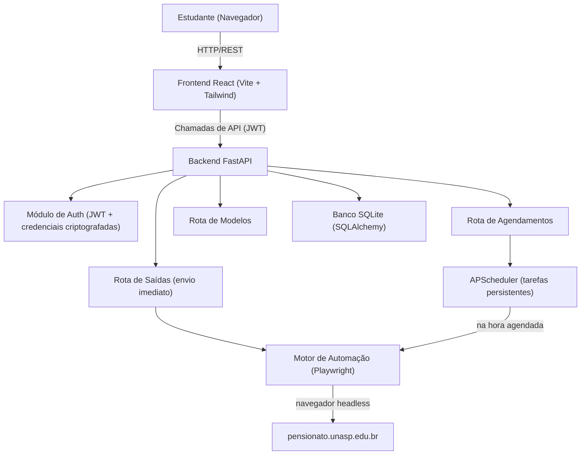
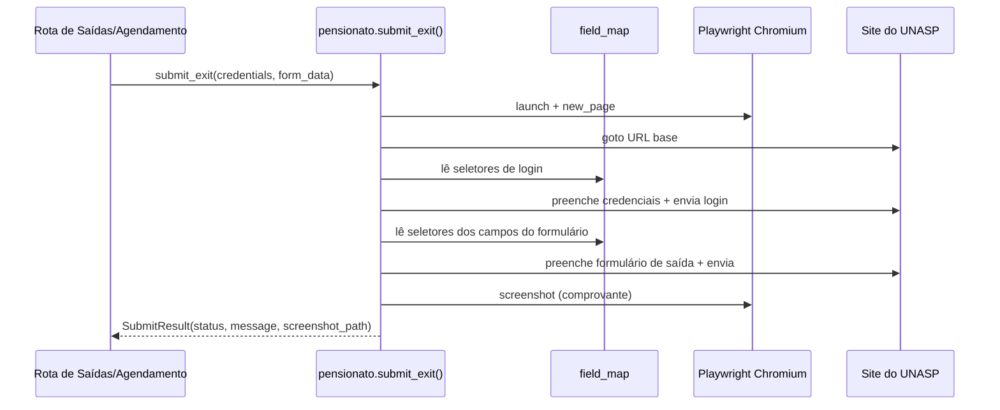
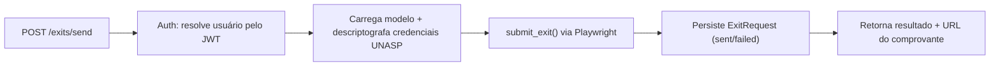

# Arquitetura

## Visão geral

## Componentes

### Frontend (`frontend/`)
Uma SPA em React + Vite + TypeScript estilizada com Tailwind. Cuida do login,
permite ao usuário gerenciar as credenciais do UNASP, criar/salvar modelos de
saída, disparar envios imediatos e criar agendamentos. Todas as requisições
passam por `src/services/api.ts`, que anexa o token JWT.

### Backend (`backend/app/`)
Uma aplicação FastAPI. Responsabilidades:

- **Auth** (`api/routes/auth.py`, `core/security.py`): cadastro/login de
  usuários da plataforma com JWT. As credenciais do UNASP são criptografadas com
  Fernet (`ENCRYPTION_KEY`) antes de serem armazenadas.
- **Saídas** (`api/routes/exits.py`): envios imediatos ("enviar agora") e
  histórico de envios.
- **Agendamentos** (`api/routes/schedules.py`): CRUD das tarefas agendadas,
  integradas ao APScheduler.
- **Modelos** (`api/routes/templates.py`): presets salvos do formulário de saída.

### Banco de dados (`backend/app/db`, `backend/app/models`)
SQLite via SQLAlchemy. Tabelas:

- `users` — contas da plataforma + credenciais do UNASP criptografadas.
- `templates` — dados reutilizáveis do formulário de saída (payload JSON).
- `schedules` — quando/com que frequência enviar, ligado a um modelo.
- `exit_requests` — cada tentativa de envio com status e caminho do comprovante.

Migrar para Postgres é só uma mudança em `DATABASE_URL`.

## Camada de automação

O coração do projeto é
[backend/app/automation/pensionato.py](../backend/app/automation/pensionato.py).
Ele inicia um Chromium headless via Playwright, faz login no UNASP, preenche o
formulário de saída, envia e captura uma imagem como comprovante.

Para se manter resiliente ao markup exato (ainda desconhecido) do formulário, os
seletores concretos ficam em um **mapa de campos** separado
([backend/app/automation/field_map.py](../backend/app/automation/field_map.py)).
O submissor lê os seletores por nome lógico (ex.: `destination`, `submit`),
então adaptar à página real só exige editar esse único arquivo.

## Agendador

[backend/app/core/scheduler.py](../backend/app/core/scheduler.py) encapsula o
APScheduler com um job store SQLAlchemy para que as tarefas sobrevivam a
reinícios. A rota de agendamentos traduz o agendamento de um usuário (data única,
diário, dias de semana ou expressão cron) em um gatilho do APScheduler. Quando
uma tarefa dispara, ela carrega o modelo vinculado + as credenciais
descriptografadas e chama a mesma função `submit_exit` usada nos envios
imediatos, registrando o resultado em `exit_requests`.

## Fluxo de requisição: "Enviar agora"

## Notas de segurança

- As senhas do UNASP nunca são armazenadas em texto puro — criptografia
  simétrica Fernet.
- O JWT protege todos os endpoints que não são de autenticação.
- Os comprovantes podem conter dados pessoais; o diretório `screenshots/` está
  no gitignore.
